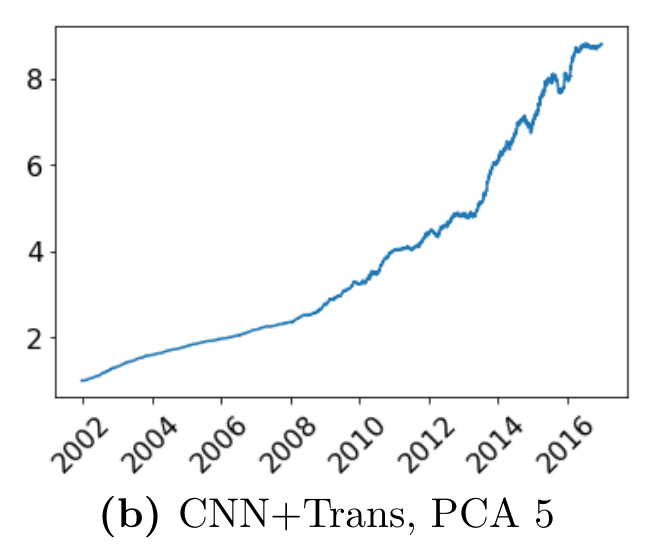
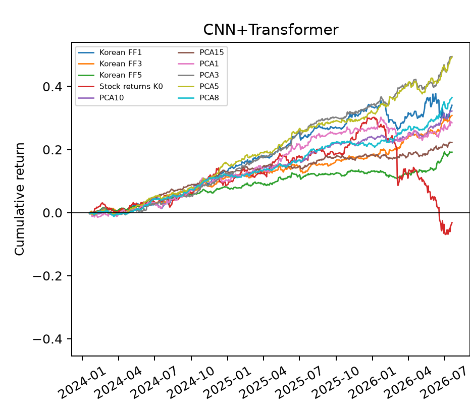
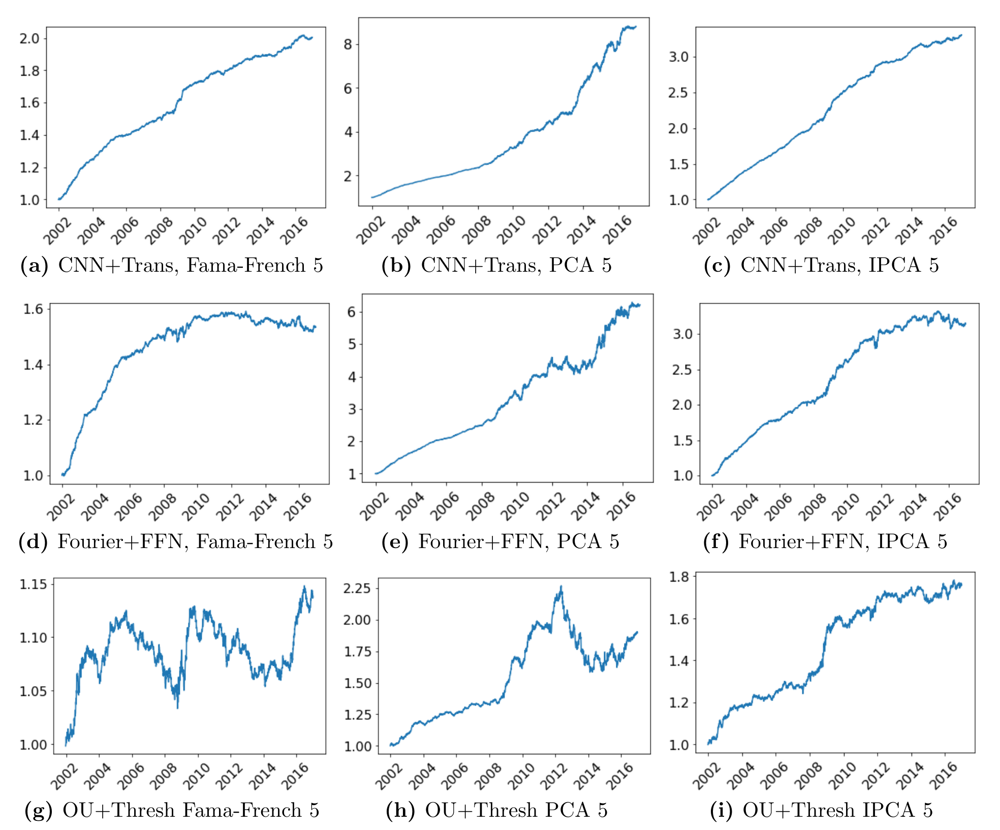
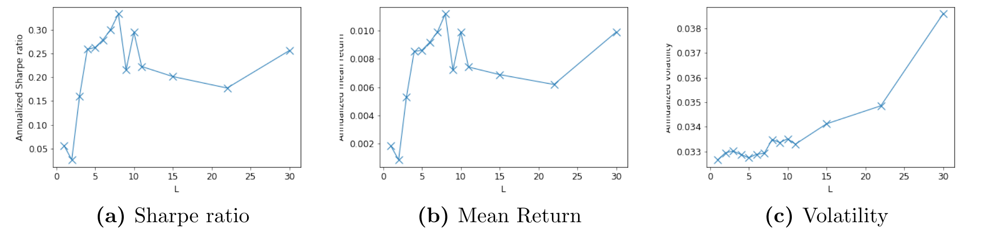
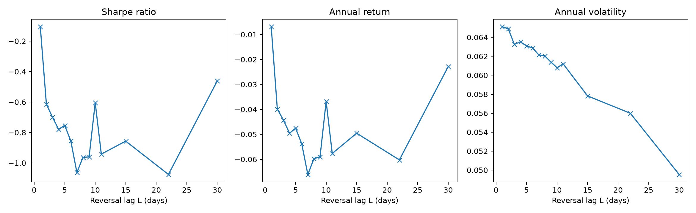

## 오늘 말씀드릴 것

1. **논문의 핵심 명제** — 잔차를 예측하지 않고, 잔차로 거래정책을 학습한다
2. **방법론적 방어** — 짧고 시끄러운 고차원 패널에서 딥러닝이 성립하는 조건
3. **무엇이 새로 발견되었나** — OU·Fourier의 표현력 한계와 학습된 구조
4. **한국 재현 결과** — 세 부품별로 원 논문 주장의 성립 여부
5. **논의사항 3건**

::: {.note}
한국 수치·그림은 재현 실행 산출물이고, 미국 수치는 원 논문 Table 1·2·4·9 및 Figure 5·6·11·14–18에서 인용했습니다.
:::

## 이 논문을 선정한 배경 {.smaller}

현재 **국내주식형 enhanced index 펀드 전략**을 리서치하고 있습니다. 구조상 벤치마크 대비
over/underweight로 수익을 내므로 active 부분은 정의상 합이 0인 롱숏이고, 벤치마크 노출은 이미 중립화되어 있습니다.
문제는 그 active 부분이 **의도하지 않은 팩터 변동에 노출**된다는 점이었습니다.

::: {.claim}
따라서 필요한 것은 market neutral을 넘어 **factor neutral한 long-short alpha**다.
[이 논문의 잔차 포트폴리오가 정확히 그 대상입니다 — 팩터 노출이 0이면서 거래 가능한 롱숏 포트폴리오.]{.sub}
:::

::: {.columns}
::: {.column width="52%"}
**주제 적합성**

- 잔차를 거래대상으로 삼는 구성이 enhanced index의 active 부분과 구조적으로 동일합니다.
- 일별 단기 알파이므로 회전율 제약 하에서 active risk budget을 배분하는 문제와 직접 연결됩니다.
:::
::: {.column width="48%"}
**재현 실행가능성**

- 필요 데이터가 일별 가격과 팩터 중심으로, **확보 난도가 높은 원자료가 상대적으로 적습니다.**
- 저자들이 **논문 코드를 공개**하여 사양을 추정하지 않고 대조할 수 있습니다.
:::
:::

::: {.note}
재현을 마친 뒤 enhanced index 운용 관점에서의 적용 가능성도 확인하고자 합니다 (논의 1).
:::

# 1. 논문의 핵심 명제

## 명제

::: {.claim}
자산가격모형의 **잔차**를 거래대상으로 삼되, 잔차를 **예측**하지 않는다.
잔차의 시계열 구조에서 신호를 추출하고, 그 신호를 비중으로 사상하는 정책을
**위험조정수익 목적함수 하에서 직접 학습**한다.
:::

$$\max_{\theta,\ w^{\epsilon}} \ \mathrm{SR}\!\left(w^{R\top}_{t-1}R_t\right) \quad \text{s.t.} \quad w^{R}_{t-1} = \frac{w^{\epsilon}(\theta_{t-1})^{\top}\Phi_{t-1}}{\lVert w^{\epsilon}(\theta_{t-1})^{\top}\Phi_{t-1}\rVert_1}, \qquad \epsilon_t = \Phi_t R_t$$

::: {.why}
[구조를 읽는 법.]{.lab}
$\Phi_t = I - \beta_t W_{F,t}^{\top}$는 팩터모형이 결정하는 사영행렬이고, 신호함수 $\theta$와 배분함수 $w^{\epsilon}$가 학습 대상입니다.
세 부품이 분리된 손실함수를 각각 최소화하지 않고 **하나의 경제적 목적함수 아래 결합 추정**됩니다.
$\lVert\cdot\rVert_1 = 1$ 정규화는 레버리지 제약인 동시에 추정 측면에서는 정칙화로 작동합니다.
:::

## 잔차는 비어 있는 집합이 아니다 {.smaller}

팩터모형이 수익률을 설명한다는 사실과, 잔차에 차익거래 기회가 없다는 것은 **다른 명제**입니다.
논문은 이를 정면으로 분리합니다 (Section 3.6).

::: {.xo}
::: {.old}
[무조건부 관점]{.hd}
동일가중 잔차 포트폴리오의 평균수익은 $K \geq 3$에서 **연 1% 이하**, 변동성도 0에 가깝습니다.

잔차는 횡단면적으로 약하게만 상관되어 **대부분 분산소거**됩니다. 여기까지만 보면 "팩터가 다 설명했다".
:::
::: {.new}
[조건부 관점]{.hd}
동일한 잔차를 **시계열 패턴에 따라 최적 거래**하면 평균수익이 **최대 50배**로 커집니다.

잔차의 정보는 무조건부 평균이 아니라 **시간에 따른 조건부 구조**에 있습니다.
:::
:::

::: {.highlight-box}
> "Unconditional means and alphas of asset pricing residuals are a **poor measure of arbitrage opportunities** …
> the unconditional perspective of evaluating asset pricing models could potentially **overstate the efficiency of markets**
> and the pricing ability of asset pricing models."

거래전략에 대한 진술이 아니라 **자산가격모형 평가 방법론에 대한 진술**입니다. 이 논문이 Management Science에 실린 이유의 상당 부분이 여기 있습니다.
:::

## 예측이 아니라 정책을 학습하는 이유 {.smaller}

::: {.xo}
::: {.old}
[예측 목적함수]{.hd}
$\min \mathbb{E}\lVert r_{t+1} - \hat{f}(x_t)\rVert^2$ 을 풀고, 예측치를 사후에 포트폴리오로 변환합니다.

- MSE는 **모든 관측치에 동일 가중**을 둡니다. 거래에서 중요한 것은 예측 정확도가 아니라 **비중을 실을 수 있는 구간의 정확도**입니다.
- 2단계 분리 하에서 1단계의 최적이 2단계의 최적을 보장하지 않습니다.
:::
::: {.new}
[거래 목적함수]{.hd}
$\max \mathrm{SR}$ 또는 평균-분산을, **제약을 포함한 채로** 직접 최적화합니다.

- 신호함수가 "거래에 쓸모 있는 표현"을 배우도록 강제됩니다.
- 레버리지·turnover·공매도 비중·거래비용이 **학습 시점에 반영**됩니다. 사후 절단이 아닙니다.
:::
:::

::: {.why}
[또 하나의 차이.]{.lab}
목적함수가 **포트폴리오 수준**에서 정의되므로, 개별 잔차의 잡음이 횡단면 집계 과정에서 상쇄됩니다.
개별 시계열 단위의 예측손실보다 **기울기 신호의 분산이 작습니다.** 짧은 표본에서 결정적인 차이입니다.
:::

# 2. 짧고 시끄러운 고차원 패널에서 딥러닝이 성립하는 조건

## 세 가지 제약 {.smaller}

| 제약 | 구체적 형태 | 통상적 귀결 |
|:--|:--|:--|
| **짧은 시계열** | 잔차 lookback $L = 30$일, 학습창 1,000일 | 시계열별 개별 적합은 즉시 과적합 |
| **낮은 신호대잡음** | 일별 잔차의 예측가능 성분이 매우 작음 | 유연한 모형일수록 잡음을 학습 |
| **고차원 입력** | 종목 $\times$ 시점 $\times$ 특성 | FFN의 curse of dimensionality |

::: {.highlight-box}
논문은 이 셋을 **모형을 키워서**가 아니라 **문제의 구조를 모형에 넣어서** 해결합니다.
다음 슬라이드의 네 가지가 그 장치이고, 이것이 이 논문이 방어하는 방법론적 핵심입니다.
:::

## 네 가지 장치 {.smaller}

**1. 횡단면 pooling — 잔차의 성질이 이것을 허용합니다.**
적절한 팩터모형의 잔차는 횡단면적으로 약하게만 상관되고 시간·횡단면 양쪽에서 국소적으로 정상적입니다.
따라서 **동일한 $\theta$와 $w^{\epsilon}$를 전 횡단면에 적용**할 수 있고, $L=30$ 차원 함수를 $N \times T$ 관측으로 추정하게 됩니다.
원 수익률은 소수 팩터가 지배하고 기업특성에 따라 이질적이라 이 pooling이 정당화되지 않습니다.

**2. 구조적 귀납편향 — 학습해야 할 것을 줄입니다.**
CNN의 가중치 공유와 attention의 sequence 구조가 시계열 의존성을 **아키텍처로 부여**합니다.
FFN은 universal approximator이지만 입력 간 복잡한 의존관계에서는 차원의 저주를 겪습니다.

**3. 절제된 사양.** 2-layer CNN, 국소필터 $D=8$, 필터폭 2, attention head $H=4$, $L=30$.
통계적으로 구분되지 않는 후보들 중 **모수가 가장 적은 사양**을 선택했습니다.

**4. 경제적 제약의 정칙화 효과.** $\lVert w \rVert_1 = 1$, rolling 1,000일 학습 · 125일 재추정 (750/1,250일에도 강건).

## Ablation이 증명하는 것 {.smaller}

논문은 "유연성이 아니라 구조가 필요하다"를 **두 개의 대조실험**으로 보입니다 (Section 3.7).

| 실험 | 설계 | 결과 |
|:--|:--|:--|
| **OU + FFN** | OU의 4차원 신호 + 유연한 FFN 배분 | 임계값 규칙과 **비슷하거나 오히려 나쁨** |
| **직접 FFN** | 시계열 신호 없이 잔차 30일 창을 FFN에 직접 투입 | 필터를 거친 딥러닝 모형보다 **뚜렷하게 열등** |

::: {.highlight-box}
> "Although the allocation function is a powerful universal approximator, it **cannot accomplish much with an information-poor input**."
> "The nonparametric FFN offers **too much flexibility without comparable efficiency**, which leads to a noisier estimate of a simple function."

첫 실험은 병목이 배분이 아니라 **신호**임을 보이고, 둘째 실험은 같은 정보를 주어도 **시계열 구조 없이는 학습되지 않음**을 보입니다.
"딥러닝이라서 좋다"가 아니라 **"어떤 딥러닝인지가 전부"**라는 것이 논문의 주장입니다.
:::

# 3. OU·Fourier가 놓친 것

## 두 벤치마크의 표현력 한계 {.smaller}

::: {.xo}
::: {.old}
[OU + Threshold]{.hd}
잔차가 평균회귀 확률과정을 따른다고 가정하고 모수를 추정 → **4차원 신호**.

- 단일 시상수의 선형 평균회귀만 표현 가능
- 추세와 반전의 **비대칭**을 표현할 수 없음
- 정보량 자체가 부족하다는 것이 ablation으로 증명됨
:::
::: {.old}
[Fourier + FFN]{.hd}
30일 창을 주파수로 분해 → 고정된 **전역 기저**.

- 기저가 사전에 고정되어 exploit 가능한 패턴이 제한됨
- 전역·정상 기저이므로 **"패턴이 창의 어느 위치에 나타났는가"를 구분하지 못함**
- 배분함수는 CNN+Transformer와 동일. 차이는 오직 신호
:::
:::

::: {.why}
[핵심.]{.lab}
두 방법 모두 **시간 가중이 상태와 무관하게 고정**되어 있습니다.
다음 슬라이드가 보이듯, 실제로 학습된 정책은 시간 가중이 **국면에 따라 달라집니다.**
이것이 두 벤치마크의 함수공간에 애초에 존재하지 않는 패턴입니다.
:::

## 학습된 구조 — 국소 필터와 attention head {.smaller}

**1단계 · CNN이 학습한 8개 국소 기본패턴** (Figure 15)

- 패턴 4, 6 → 국소 상승추세 &nbsp;·&nbsp; 패턴 3, 7 → 국소 하락추세 &nbsp;·&nbsp; 패턴 1, 5, 8 → 반전(reversion)
- 급격한 spike는 포함하지 않음. **매끄러운 추세·평균회귀 패턴의 기저**를 구성합니다.

**2단계 · Transformer의 4개 attention head가 이를 전역 패턴으로 결합** (Figure 16–18)

| head | 논문의 명명 | 활성화 조건 |
|:-:|:--|:--|
| 4 | *negative reversal* | 고빈도 반전. **하락 국면**에 활성화되며 **직전 구간**에 집중 |
| 3 | *early reversal* | 반전 사이클의 정점이 **창의 앞부분에 나타날 때만** 활성화. 같은 사이클이 창의 끝에서 정점이면 활성화되지 않음 |
| 1 | head 4의 감쇠형 | 창 전체에 비교적 균일하게 분포 |

::: {.highlight-box}
**head 3이 결정적입니다.** "같은 모양이라도 창의 앞쪽에 나타났을 때만 반응한다"는 것은 **위치 의존적** 규칙입니다.
전역 Fourier 기저는 위상 이동에 대해 등변(equivariant)이므로 이 구분을 표현할 수 없고, OU의 4차원 요약통계에는 위치 정보가 남아 있지 않습니다.
:::

## 비대칭성 — 상승에는 먼 과거를, 하락에는 최근을 {.smaller}

::: {.claim}
상승국면에서는 30일 창의 **앞부분**에, 하락국면에서는 **가장 최근** 구간에 attention이 집중된다.
[Section 3.15, Figure 18(b). 즉 시간 가중 자체가 상태의 함수입니다.]{.sub}
:::

::: {.why}
[왜 이것이 OU·Fourier로 도달 불가능한가.]{.lab}
OU는 하나의 평균회귀 속도를 상태와 무관하게 적용하고, Fourier는 고정 기저의 계수만 바꿉니다.
둘 다 **시간 가중이 상수**입니다. 반면 attention 가중치는 입력 자체의 함수이므로
"지금이 하락국면인가"에 따라 **참조 구간이 이동**합니다. 이것이 성과 차이의 함수공간 상 근거입니다.
:::

::: {.note}
경제적 해석: 하락 시에는 최신 정보에 빠르게 반응하고, 상승 시에는 더 긴 확인 구간을 요구합니다.
사후적으로는 자연스럽지만 사전에 모수형으로 설정하기 어려운 형태이며, 논문은 이를 데이터에서 얻었습니다.
:::

## 그리고 이것은 위험 프리미엄이 아니다 {.smaller}

::: {.nums}
::: {.n .dim}
[1.23]{.v}
[IPCA-5 팩터의 평균-분산 효율 조합 (SDF 포트폴리오) Sharpe]{.k}
:::
::: {.n}
[4.16]{.v}
[동일 IPCA-5 잔차의 CNN+Transformer 차익거래 Sharpe]{.k}
:::
::: {.n .dim}
[0.02]{.v}
[차익거래 전략을 IPCA-5 팩터에 회귀한 $R^2$]{.k}
:::
:::

동일한 팩터모형에서 나온 두 포트폴리오가 **사실상 무상관**입니다. 위험 프리미엄을 얻는 투자와 차익거래는
개념적으로 구분되며, 투자자는 **둘을 결합해 분산이익**을 얻을 수 있습니다 (Section 3.14).

# 4. 한국 재현

## 재현 조건 {.smaller}

| 항목 | 원 논문 (미국) | 본 연구 (한국) | |
|:--|:--|:--|:-:|
| 원자료 | 1978–2016 CRSP | 2015–2026 국내 일별 (8,651,872행, 4,962종목) | 상이 |
| 잔차 표본 | 1998–2016 (19년) | 2020-01-02 ~ 2026-07-20 (1,606일) | **논의 1** |
| 정책 OOS | 2002–2016 (15년) | 2024-01-19 ~ 2026-07-20 (606일, 2.4년) | **논의 1** |
| 일별 종목수 | 약 550 | 127 ~ 185 | 상이 |
| universe | 전월말 시총 > 전체의 0.01% | 동일 규칙, KOSPI·KOSDAQ 보통주 | 동일 |
| 수익률 정의 | CRSP total return | 권리·분할 조정 price return, 현금배당 제외 | **논의 2** |
| 팩터모형 | FF 1/3/5/8, PCA, IPCA | 한국 FF 1/3/5, PCA $K$ = 0~15, **IPCA 미완** | **논의 3** |
| 신경망·학습 | $D$=8, $H$=4, $L$=30, 1,000일 학습, 125일 재추정, 100 epoch | 동일 | 동일 |
| 거래비용 | 5 bp 거래 + 1 bp 공매도 보유 | 동일 | 동일 |

## ① 잔차 — 잔차화가 전제조건임을 재확인 {.smaller}

신경망과 배분함수를 고정하고 **입력만 원 수익률로 교체**한 대조입니다.

::: {.nums}
::: {.n .dim}
[−0.08]{.v}
[한국 · 원 수익률 ($K$ = 0)]{.k}
:::
::: {.n}
[4.15]{.v}
[한국 · PCA5 잔차]{.k}
:::
::: {.n .dim}
[1.64]{.v}
[미국 · 원 수익률 ($K$ = 0)]{.k}
:::
::: {.n}
[3.36]{.v}
[미국 · PCA5 잔차]{.k}
:::
:::

::: {.highlight-box}
논문의 pooling 논거가 한국에서 **더 강하게** 확인됩니다. 원 수익률은 소수 팩터가 지배하여
독립적인 시계열 정보가 부족하고 종목 간 이질성이 커서 공통 함수 추정이 성립하지 않는데,
미국은 그럼에도 1.64가 남는 반면 한국은 음수로 붕괴합니다.
:::

::: {.note}
한국 잔차 산출물: 275,711행, 2020-01-02 ~ 2026-07-20, 일별 127~185종목, 한국 FF1/3/5 및 PCA $K$ = 0~15.
$K$ = 0 수치는 양 시장 모두 CNN+Transformer 정책 기준입니다.
:::

## ① 잔차 — IPCA 미완의 성격 {.smaller}

| 제약 | 논문 요구 | 한국 데이터 |
|:--|:--|:--|
| 추정창 | 240개월 rolling | **139개월** (2015-01 ~ 2026-07) |
| 특성 관측 | 46개 | 회계특성 37~42%, D2P 5.4%, 6개는 문서화된 proxy |
| 수치 수렴 | ALS tolerance 1e-3 | $K$=5·60개월 **비수렴** (final delta 3.71 / 2.4e23) |

::: {.highlight-box}
논문 자체가 팩터모형 선택은 부차적이라고 규정합니다 — CNN+Transformer 기준
**FF5 3.21 · PCA5 3.36 · IPCA5 4.16**. 미확보분은 **최적 사양이지 논문의 명제가 아닙니다.**
다만 IPCA5가 유일하게 4를 넘고 논문의 대표 사양이므로, 재현 완결성 측면에서는 미완으로 남습니다. → 논의 3
:::

::: {.note}
공개 코드의 $\Gamma$ 추정에는 정칙화가 없습니다. 240개월이라는 표본량이 곧 식별 조건이며,
표본이 짧아졌을 때의 안전장치가 설계상 존재하지 않습니다.
:::

## ② 신호 — "신호가 병목"이라는 명제의 검정 {.smaller}

잔차와 배분함수를 고정하고 **신호함수만 교체**했습니다 (PCA5, Sharpe 목적함수).

| 신호 | 배분 | 미국 (PCA5) | 한국 (PCA5) |
|:--|:--|--:|--:|
| OU (4차원 요약통계) | 임계값 규칙 | 0.73 | 1.47 |
| Fourier (고정 전역기저) | 신경망 | 1.98 | 3.27 |
| **CNN + Transformer (학습된 필터)** | 신경망 | **3.36** | **4.15** |

::: {.columns}
::: {.column width="52%"}
**성립한 것**

- 서열이 두 시장에서 동일합니다.
- Fourier+FFN과 CNN+Transformer는 **배분함수가 동일**하므로 3.27 → 4.15는 순수하게 신호 표현력의 기여입니다.
:::
::: {.column width="48%"}
**차이**

- 한국은 전 사양이 미국보다 높고, 특히 파라메트릭 OU가 두 배입니다.
- 따라서 학습된 필터의 **상대적 기여는 한국에서 더 작습니다** (미국 ×1.7, 한국 ×1.27).
- 유니버스 규모·표본기간 차이에서 오는 착시 가능성을 배제할 수 없습니다.
:::
:::

::: {.note}
미국 수치는 원 논문 Table 1의 PCA 열 $K$=5행입니다. 본문에서 강조되는 4.16은 **IPCA5** 기준이며 PCA5와 구분됩니다.
:::

## ② 신호 — 표본외 누적수익률 {.smaller}

::: {.columns}
::: {.column width="46%"}
### 미국 · 원 논문 Figure 5 (b)

{width="92%"}

OOS 2002–2016 (15년). 누적 8.7배.
:::
::: {.column width="54%"}
### 한국 · 본 연구 (CNN+Transformer)

{width="78%"}

OOS 2024-01 ~ 2026-07 (2.4년). PCA5 누적 +48%.
:::
:::

::: {.note}
축 단위가 다릅니다 (미국 15년 누적배수, 한국 2.4년 누적수익률).
한국 그림의 빨간 선이 원 수익률($K$=0)이며 2026년 들어 크게 손실이 났습니다.
:::

## ② 신호 — 전 사양 비교 {.smaller}

::: {.columns}
::: {.column width="50%"}
### 미국 (원 논문 Figure 5)

{width="100%"}

행 = 정책, 열 = 잔차 모형 (FF5 · PCA5 · IPCA5).
:::
::: {.column width="50%"}
### 한국 (본 연구)

{width="100%"}

열 = 정책, 색 = 잔차 모형 (한국 FF1/3/5 · PCA $K$ = 0~15).
:::
:::

::: {.note}
정책 간 서열(CNN+Trans > Fourier+FFN > OU)이 두 시장에서 동일합니다.
누적곡선만으로 거래가능성을 판단할 수 없고 다음의 마찰 결과와 함께 보아야 합니다.
:::

## ③ 정책 — 원 논문의 ablation을 한국에서 재현 {.smaller}

::: {.nums}
::: {.n .dim}
[2.19]{.v}
[직접 FFN 시계열 신호 없이 잔차 → 비중]{.k}
:::
::: {.n .dim}
[1.88]{.v}
[OU + FFN 신호 고정, 배분만 유연]{.k}
:::
::: {.n}
[4.15]{.v}
[CNN + Transformer 기준 사양]{.k}
:::
:::

::: {.highlight-box}
두 ablation의 **방향과 서열이 원 논문과 동일**합니다. 유연한 배분함수는 정보가 빈약한 신호를 보상하지 못하고,
시계열 구조 없이 유연성만 늘리면 오히려 추정 잡음이 커집니다.
2절에서 말씀드린 "구조가 유연성을 대체한다"는 논거가 한국 데이터에서도 성립합니다.
:::

## ③ 정책 — 제약을 목적함수에 넣은 효과 {.smaller}

::: {.columns}
::: {.column width="50%"}
{width="100%"}

한국 · 동일 두 목적함수, PCA·FF 잔차 계열 중첩
:::
::: {.column width="50%"}
| 지표 (PCA5, CNN+Trans) | 비용 미반영 | 비용 반영 |
|:--|--:|--:|
| Sharpe ratio | 4.15 | **1.37** |
| 연수익률 | 16.8% | 6.0% |
| 일별 turnover | 1.214 | **0.464** |

비용을 알고 학습한 모형은 **회전율을 62% 축소**해 대응합니다.
사후 절단이 아니라 정책 자체가 달라진 것이며, 제약을 목적함수에 내생화한 설계의 직접적 증거입니다.
:::
:::

::: {.highlight-box}
**1.37이 실질값이고 4.15는 마찰 부재 하의 상한입니다.** 원 논문도 IPCA 기준 4.16 → 0.94 ~ 1.24로 하락합니다.
:::

# 5. 방어 검정

## 논문이 통과시켜야 하는 네 가지 {.smaller}

::: {.why}
[쟁점.]{.lab}
"잔차라고 부르지만 실제로는 누락된 위험요인에 대한 프리미엄 아닌가"가 가장 강한 반론입니다.
아래 넷 중 하나라도 실패하면 차익거래가 아니라 팩터 전략입니다.
:::

| | 검정 | 원 논문 결과 | 한국 |
|:-:|:--|:--|:--|
| **1** | 기존 위험요인에 직교하는가 | FF8 대비 $\alpha$ 유의, $R^2 \approx 0$ | 재현 (다음 장) |
| **2** | 단순 반전으로 설명되는가 | 단순 반전은 Sharpe 최대 0.3에 그침 | 재현, 단 부호가 다름 |
| **3** | 마찰 하에서 생존하는가 | 4.16 → 0.94 ~ 1.24 | 4.15 → 1.37 |
| **4** | 시기·사양에 강건한가 | lookback·재추정 주기·보유기간에 강건 | 재현 |

## 검정 1 — 알파 {.smaller}

| PCA 팩터 수 $K$ | 연 $\alpha$ | $t(\alpha)$ | $R^2$ | 연 $\mu$ | $t(\mu)$ |
|:--|--:|--:|--:|--:|--:|
| 0 (원 수익률) | −5.3% | −0.81 | 5.2% | −0.8% | −0.13 |
| 1 | 10.1% | 2.87 | 0.7% | 10.6% | 3.07 |
| 3 | 17.4% | 6.20 | 1.9% | 16.8% | 6.05 |
| **5** | **16.7%** | **6.31** | **0.9%** | **16.8%** | **6.43** |
| 8 | 13.3% | 5.55 | 1.5% | 13.0% | 5.49 |
| 10 | 12.3% | 5.53 | 1.8% | 11.7% | 5.29 |
| 15 | 9.4% | 4.91 | 2.7% | 8.4% | 4.39 |

- $R^2 < 3\%$, 그리고 $\alpha \approx \mu$ (16.7% 대 16.8%) — 수익의 거의 전부가 기존 요인으로 설명되지 않습니다.
- $K = 0$에서만 유의하지 않아, 잔차화가 선행조건이라는 ①의 결론과 정합적입니다.

::: {.note}
CNN+Transformer, Sharpe 목적함수. 알파 기준은 한국 FF5 + MOM 6팩터이며 원 논문의 FF8이 아닙니다 (STREV·LTREV 정의 미확보).
:::

## 검정 2 — 단순 반전으로 설명되지 않는다 {.smaller}

::: {.columns}
::: {.column width="50%"}
### 미국 (원 논문 Figure 11)

{width="100%"}

IPCA5 잔차. 전 lag에서 Sharpe **양수**이나 최대 0.3.
:::
::: {.column width="50%"}
### 한국 (본 연구)

{width="100%"}

PCA5 잔차. 전 lag에서 Sharpe **음수** (−0.1 ~ −1.1).
:::
:::

::: {.highlight-box}
**결론은 동일하나 경로가 다릅니다.** 미국은 반전 프리미엄이 존재하되 4.16을 설명하기에 크게 부족하고,
한국은 반전 프리미엄 자체가 부재합니다. 3절에서 본 학습된 패턴이 단순 반전보다 복잡하다는 논문의 주장은
한국에서 오히려 더 강하게 지지됩니다.
:::

::: {.note}
전략 정의 동일 — 과거 $L$일 시점 누적잔차 하위 20% 매수, 상위 20% 매도. 잔차 모형만 IPCA5(미국) / PCA5(한국).
:::

## 검정 3·4 — 마찰과 강건성 {.smaller}

::: {.columns}
::: {.column width="55%"}
| 사양 변경 | Sharpe | 원 논문과 |
|:--|--:|:--|
| 기준 ($L$ = 30) | 4.15 | — |
| $L$ = 60 | 3.45 | 일치 |
| 고정 모형 (재추정 없음) | 4.15 | 일치 |
| 5일 보유 | 3.11 | 일치 |
| 거래비용 반영 | 1.37 | 일치 |
:::
::: {.column width="45%"}
::: {.why}
[5일 보유의 의미.]{.lab}
매일 재조정하지 않아도 3.11이 남습니다. 신호가 일별 잡음이 아니라
**수일간 지속되는 구조**임을 뜻하며, 논문의 persistence 논거와 일치합니다.
동시에 회전율 제약 하의 실행가능성 근거이기도 합니다.
:::
:::
:::

# 6. 한국에서 갈린 지점과 유보사항

## 원 논문과 다른 네 가지 {.smaller}

| | 현상 | 해석 |
|:-:|:--|:--|
| **1** | 원 수익률($K$=0)이 음수 (미국 1.64) | 요인 지배력이 더 강해 pooling 전제가 더 크게 위배됨 |
| **2** | 단순 반전이 전 lag 음수 (미국 양수) | 한국에 단기 반전 프리미엄이 부재 |
| **3** | 비중 상위만 남기는 sparsification 이득 없음 | 수익원이 소수 종목이 아니라 횡단면 전반에 분산 |
| **4** | $K$ = 15에서 성과 하락 (미국은 평탄) | 일별 127~185종목에서 15팩터는 잔차의 정보를 고갈시킴 |

::: {.highlight-box}
4번은 유니버스 규모에서 직접 오는 제약입니다. 미국의 "$K$를 늘려도 평탄하다"는 결론은
$N \approx 550$에 의존하므로 한국에 그대로 이전되지 않습니다. 확장 연구의 자연스러운 출발점입니다.
:::

## 유보사항 {.smaller}

- **4.15는 마찰 부재 상한, 1.37이 실질값**입니다.
- **표본외 2.4년.** 원 논문 15년 대비 짧습니다 (논의 1).
- **price return 기준**이므로 원 논문의 total-return 경제성과 직접 비교되지 않습니다 (논의 2).
- **IPCA 잔차 미확보**로 원 논문 Figure 6·11을 PCA 잔차에 대응시켰습니다 (논의 3).
- **알파 기준이 한국 FF5 + MOM 6팩터**이며 원 논문의 FF8이 아닙니다.
- **PCA $K > 0$의 시점 처리** — 저자 공개 코드가 잔차 구성행렬 추정창에 당일 수익률을 포함하여 본문의 point-in-time 계약과 어긋납니다. 본 발표 수치는 공개 코드 기준이며 재실행이 필요합니다.
- 한국 성과가 전반적으로 높은 것은 **유니버스 규모(127~185 대 550)와 표본기간**에서 오는 착시일 수 있습니다.

# 7. 논의사항 3건

## 논의 1 — 표본외 기간 {.smaller}

| | 원 논문 (미국) | 현재 (한국) | 확보 가능 최대 |
|:--|:--|:--|:--|
| 원자료 | 1978 – 2016 | 2015-01 – 2026-07 | 2015-01 – 2026-07 |
| 잔차 표본 | 1998 – 2016 (19년) | 2020-01 – 2026-07 (1,606일) | 2016 – 2026 (약 10년) |
| **정책 OOS** | **2002 – 2016 (15년)** | **2024-01 – 2026-07 (2.4년)** | **약 6 – 7년** |

::: {.ask}
[여쭙고 싶은 것]{.hd}
1. 표본외 2.4년으로 학위논문의 주장을 세울 수 있습니까? 최소 어느 정도를 요구하시겠습니까?
2. 잔차 표본을 2016년으로 앞당기면 OOS가 6~7년이 됩니다. 학습창 1,000일·125일 재추정 계약을 유지하면 전 구간 재실행이 필요합니다. 진행할까요?
3. 2015년 이전 일별 자료 확보에 시간을 쓰는 것과, 현재 구간에서 분석의 깊이를 더하는 것 중 어느 쪽이 낫겠습니까?
4. 후자라면, **enhanced index 펀드의 active 부분에 이 잔차 전략을 적용하는 확장**을 학위논문의 기여로 삼을 수 있겠습니까? 벤치마크 대비 tracking error 예산과 회전율 제약 하에서의 구현이 됩니다.
:::

## 논의 2 — 수익률 정의 {.smaller}

| | 원 논문 | 본 연구 현재 |
|:--|:--|:--|
| 수익률 | CRSP total return | 권리·분할 조정 price return |
| 현금배당 | 포함 | **제외** |
| 상장폐지 수익률 | 포함 | **미확보** |

::: {.columns}
::: {.column width="48%"}
**예상 영향**

- 롱숏 잔차 전략이라 배당의 시장 전체 효과는 상당 부분 상쇄됩니다.
- 배당락일 전후 잔차의 체계적 왜곡 가능성이 있습니다.
- 고배당 종목이 지속적으로 저평가 잔차로 분류될 수 있습니다.
:::
::: {.column width="52%"}
::: {.ask}
[여쭙고 싶은 것]{.hd}
1. price return으로 진행해도 됩니까, 아니면 total return이 필수입니까?
2. 필수라면 배당 원자료 확보를 다른 작업보다 우선할까요?
3. 배당락 sensitivity 분석 추가로 충분한 방어가 됩니까?
:::
:::
:::

## 논의 3 — IPCA 처리 {.smaller}

| 쟁점 | 현재 | 선택지 |
|:--|:--|:--|
| 표본 길이 | 논문 240개월, 국내 139개월 | 창 완화 후 sensitivity 표기 / 240개월 확보까지 보류 |
| 특성 집합 | 미국 46개 정의 이식 (427,076 종목-월) | 46개 유지 / **관측률 90% 이상으로 축소** |
| proxy | Spread · Beta 계열 · CF · NI | proxy 유지 / 해당 특성 제외 / 원천 확보 |
| 시점 정렬 | 공시일 vintage 부재 → 회계연도 말 + 3개월 고정 lag | 고정 lag 유지 / 공시일 자료 확보 |
| 수치 안정성 | $K$=5·60개월 ALS 비수렴 | $\Gamma$ 정칙화 (원 논문에 없음) / 특성 축소 |

::: {.ask}
[여쭙고 싶은 것]{.hd}
1. 미국 46개 정의를 그대로 유지하는 것과 한국에서 관측되는 특성으로 재구성하는 것 중 어느 쪽이 방어에 유리합니까?
2. 공개 코드에는 $\Gamma$ 정칙화가 없습니다. 도입하면 추정량 자체의 변경인데, 한계로 명시하고 진행해도 됩니까?
3. 팩터모형 선택이 부차적이라는 논문의 결론(FF5 3.21 · PCA5 3.36 · IPCA5 4.16)에 근거해, PCA·FF로 마무리하고 IPCA를 향후 과제로 서술해도 되겠습니까?
:::
