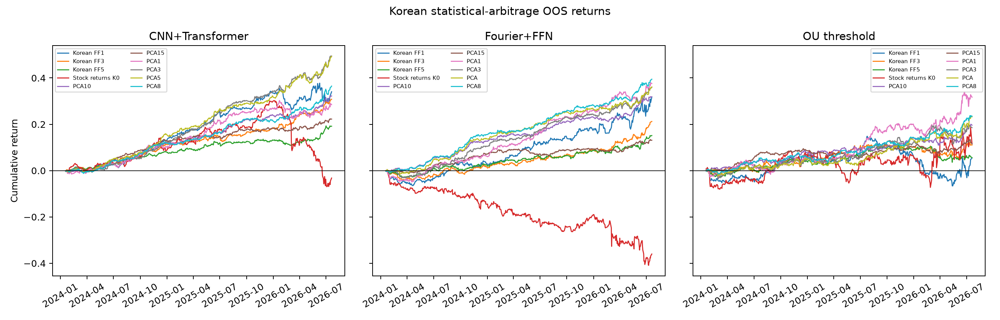
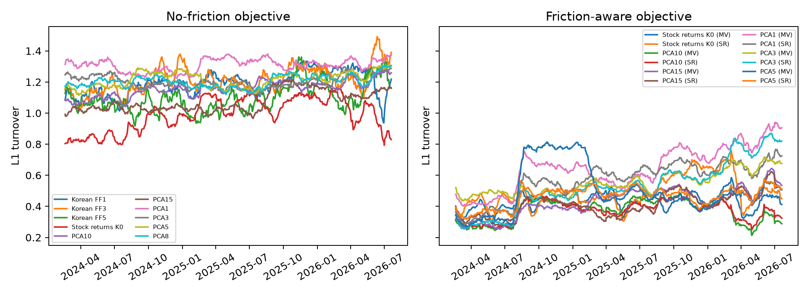

## 오늘 말씀드릴 것

1. **논문 소개** — 무엇을 하는 논문이고 왜 이 논문을 골랐는지
2. **구현 현황** — 미국 결과와 한국 결과를 나란히 놓고 대조
3. **쟁점 및 질문** — 판단을 여쭙고 싶은 것들

::: {.note}
미국 수치·그림은 원 논문 Table 1·2, Figure 2·3·4·5를 그대로 캡처했습니다.
한국 수치는 재현 실행 산출물에서 옮긴 값이며 발표자료가 따로 계산하지 않았습니다.
:::

# 1. 논문 소개

## 왜 이 논문을 골랐나

지금 회사에서 **국내주식형 enhanced index 펀드**를 리서치하고 있습니다.
구조상 벤치마크 대비 over/underweight로 수익을 내므로 active 부분은 정의상 합이 0인 롱숏입니다.

문제는 그 active 부분이 의도하지 않은 팩터 변동에 노출된다는 것이었습니다.
market neutral만으로는 부족하고 **factor neutral한 long-short alpha**가 필요합니다.

이 논문의 잔차 포트폴리오가 정확히 그 대상입니다. 팩터 노출이 0이면서 거래 가능한 롱숏 포트폴리오입니다.

- 재현 난도 측면에서도 유리합니다. 필요 데이터가 일별 가격과 팩터 중심이라 확보 난도가 높은 원자료가 적습니다.
- 저자들이 코드를 공개해서 사양을 추측하지 않고 대조할 수 있습니다.

## 통계적 차익거래를 세 단계로 분해

> "Statistical arbitrage exploits *temporal* price differences between *similar* assets."

논문의 프레임워크는 이 한 문장을 세 개의 질문으로 쪼갠 것입니다.

1. **페어를 어떻게 잡는가** — "similar"의 정의
2. **어떤 시계열 신호가 일시적 괴리를 보여주는가** — "temporal"의 정의
3. **그 신호로 제약 하에서 어떻게 집행하는가**

기존 문헌은 이 셋을 각각 풀었고 단계별로 분해해서 비교할 수 없었습니다.
이 논문은 세 부품을 분리해 놓고 **다른 조건을 고정한 채 한 부품씩 갈아끼워 비교**합니다.

::: {.note}
논문의 기여 중 상당 부분이 "새 모델"이 아니라 이 분해 자체에 있습니다. 재현도 이 구조를 그대로 따라갑니다.
:::

## 1단계 — 잔차가 곧 거래 가능한 포트폴리오

$$\epsilon_t = \left(I_N - \beta_{t-1}W_{F,t-1}^{\top}\right)R_t = \Phi_{t-1}R_t$$

페어를 종목-종목으로 잡지 않습니다. **target stock 대 mimicking portfolio**로 잡습니다.

- 짝이 될 종목이 실제로 없어도 시장에서 합성해서 만들 수 있습니다.
- $\Phi$의 $n$번째 행이 그대로 종목 비중 벡터입니다. 추상적인 회귀 잔차가 아니라 실제 주문서입니다.
- 설계상 팩터 노출이 0입니다 ($\Phi\beta = 0$).

팩터모형 선택이 곧 "유사성"의 정의가 됩니다.

| 팩터 | mimicking portfolio의 의미 |
|:--|:--|
| PCA | 과거 수익률 상관이 가장 높은 잘 분산된 포트폴리오 |
| IPCA | 기업특성이 가장 비슷한 포트폴리오 |
| FF5 | 동일한 펀더멘털 팩터 노출을 가진 포트폴리오 |

## 잔차를 쓰는 또 하나의 이유

원 수익률은 소수 팩터가 지배하고 기업특성에 따라 이질적입니다.
종목이 500개여도 실질적으로 독립인 시계열 정보는 훨씬 적습니다.

> "stock returns are **dominated by a few factors**, which severely limits the actual independent
> time-series information, and are **strongly heterogenous** due to their variation in firm characteristics.
> ... residuals capture **relative movements and remove the level component**."

팩터를 빼면 잔차는 횡단면 상관이 약해집니다.

--> 이질적인 종목들을 동질적으로 만들어 **모든 종목에 하나의 공통 모델**을 쓸 수 있게 됩니다.
--> 학습 표본이 종목 수만큼 늘어납니다. 이게 없으면 30일짜리 시계열 모델을 딥러닝으로 학습할 수 없습니다.

::: {.note}
뒤에서 보시겠지만 잔차를 안 쓴 $K=0$ 결과가 한국에서 무너지는 것이 이 주장의 직접적인 확인입니다.
:::

## 2단계 — 신호 추출: 필터 관점

논문은 시계열 신호 추출을 **필터 문제**로 재정의합니다.

| 방법 | 무엇이 사전에 고정되나 | 신호 차원 |
|:--|:--|:--:|
| OU + Threshold | 함수 형태 전체 (단일 시상수 평균회귀) | 5 |
| Fourier + FFN | 기저함수 (sin, cos) | 30 |
| **CNN + Transformer** | **아무것도 고정하지 않음** | 8 |

> "we do not prescribe a potentially misspecified function to extract the time series structure,
> for example, by estimating the parameters of a given parametric time-series model,
> or the coefficients of a decomposition into given basis functions, as in conventional methods."

--> Fourier는 sin/cos를 사람이 미리 정해두지만, CNN은 **필터 자체를 데이터가 정합니다.**

## CNN — 국소 패턴을 학습

{width="72%"}

- 입력은 30일 누적 잔차 벡터 하나. 출력은 $30 \times 8$ 행렬.
- 필터 폭이 2인 층을 2개 쌓아 **3일짜리 국소 패턴**을 인식합니다.
- 같은 필터를 30개 위치 × 전 종목 × 전 기간에 재사용합니다 (weight sharing).
  CNN 파라미터는 144개인데 학습 표본은 수십만 개입니다.

## 학습된 필터가 무엇이었나

{width="88%"}

저자가 "이런 패턴을 찾아라"고 지시한 것이 아닙니다. 랜덤 초기화에서 출발해
샤프비율을 최대화하도록 학습한 결과 **네트워크가 스스로 찾아낸 것**입니다.

::: {.note}
8개 중 하나는 "평평한" 패턴을 배웠고 모형이 사실상 무시합니다 (Figure 19a). 손으로 설계했다면 나오지 않았을 결과입니다.
:::

## Transformer — 국소 패턴을 전역 패턴으로

{width="60%"}

CNN은 3일 창만 봅니다. 30일 전체 구조는 attention head 4개가 잡습니다.

--> Fourier가 sin/cos라는 **고정 기저**에 사영하는 자리를, **학습된 기저**가 대체합니다.

## 3단계 — 수익률을 예측하지 않습니다

$$\max_{\theta,\ w^{\epsilon}} \ \mathrm{SR}\!\left(w^{R\top}_{t-1}R_t\right)
\quad \text{s.t.} \quad w^{R}_{t-1} = \frac{w^{\epsilon}(\theta_{t-1})^{\top}\Phi_{t-1}}{\lVert w^{\epsilon}(\theta_{t-1})^{\top}\Phi_{t-1}\rVert_1}$$

여기가 다른 ML 자산가격 논문과 갈리는 지점입니다.

- MSE를 최소화하지 않습니다. **샤프비율을 직접 최적화**합니다.
- 신호함수와 배분함수를 **동시에** 추정합니다. 고전 방식은 OU 추정 후 별도로 threshold를 고르는 2단계입니다.
- 레버리지, 거래비용, 공매도 비중이 **학습 시점에** 목적함수 안에 들어갑니다. 사후 절단이 아닙니다.

> "The return prediction literature is fundamentally estimating the **risk premia** of assets,
> while our focus is on understanding and exploiting the **temporal deviations thereof**."

## 이 논문이 Management Science에 실린 이유

거래전략 논문이 아니라 **자산가격모형 평가 방법론**에 대한 논문이기도 합니다.

- **무조건부로 보면** 동일가중 잔차 포트폴리오의 평균수익은 $K \geq 3$에서 연 1% 이하입니다.
  여기까지만 보면 "팩터가 다 설명했다"입니다.
- **같은 잔차를 시계열 패턴에 따라 거래하면** 평균수익이 최대 50배가 됩니다.

> "Unconditional means and alphas of asset pricing residuals are a **poor measure of arbitrage opportunities** ...
> the unconditional perspective could potentially **overstate the efficiency of markets**."

--> 잔차의 정보는 무조건부 평균이 아니라 시간에 따른 **조건부 구조**에 있다는 주장입니다.

## 원 논문 Table 1

{width="63%"}

::: {.note}
이 표가 재현의 대조 기준입니다. 다음 파트에서 한국 결과를 이 표와 같은 축으로 놓고 비교합니다.
:::

# 2. 구현 현황

## 표본과 실행 계약

| 항목 | 미국 (원 논문) | 한국 (재현) |
|:--|:--|:--|
| 잔차 표본 | 1998-01 ~ 2016-12 | 2020-01-02 ~ 2026-07-20, 1,606일 |
| **정책 OOS** | **2002-01 ~ 2016-12, 15년** | **2024-01-19 ~ 2026-07-20, 606일** |
| 종목 수 | 550 (대형·고유동성) | 127 ~ 185 (KOSPI + KOSDAQ) |
| 수익률 정의 | total return | 조정 price return (**현금배당 제외**) |
| 팩터모형 | FF5, PCA, IPCA | 한국 FF1/3/5, PCA (**IPCA 차단**) |
| lookback | 30일 | 30일 (동일) |
| 학습 계약 | 1,000일 학습, 125일 재학습 | 동일, seed 0, 100 epochs |
| 알파 기준 | FF8 | 한국 FF5 + MOM (6팩터) |

**어느 것도 미국 결과의 exact replication이 아닙니다.** 한국 price-return variant입니다.

## 무엇이 돌아갔나

세 부품이 모두 구현되어 end-to-end로 돌아갑니다.

- 식 (1) `Phi = I - beta W_F.T` 잔차 구성, 식 (3) 잔차 비중의 종목 상계와 L1 정규화
- 한국 FF1/FF3/FF5 + MOM 일별 팩터 자체 구축, PCA rolling 잔차 (252일 공분산 / 60일 loading)
- OU+Threshold, Fourier+FFN, CNN+Transformer 세 정책 전부
- 목적함수 3종: Sharpe, mean-variance, 거래비용 반영
- Ablation 2종: direct FFN, OU-feature FFN
- 하이퍼파라미터 16개 grid, 대안 네트워크 5종 × 잔차 2종
- 강건성: 60일 lookback, 5일 보유, 가중치 집중도, 단순 반전 벤치마크

최종 무인 실행 `run-20260811T021314Z`에서 11개 태스크 성공, 실패 0건, 테스트 67개 통과.

## 정책 비교 — 미국 vs 한국 {.smaller}

PCA 5팩터 잔차, 거래비용 미반영, 연율 기준입니다.

| 정책 | 미국 SR | 미국 $\mu$ | 미국 $\sigma$ | 한국 SR | 한국 $\mu$ | 한국 $\sigma$ |
|:--|--:|--:|--:|--:|--:|--:|
| OU + Threshold | 0.73 | 4.4% | 6.1% | **1.47** | 8.9% | 6.0% |
| Fourier + FFN | 1.98 | 12.4% | 6.3% | **3.27** | 12.9% | 4.0% |
| CNN + Transformer | 3.36 | 14.3% | 4.2% | **4.15** | 16.8% | 4.0% |

::: {.highlight-box}
**정책 간 순서가 그대로 재현됩니다.** OU < Fourier < CNN+Transformer.
한국 수준이 전반적으로 높지만, OOS가 2.5년뿐이고 종목 수가 3분의 1이라 그대로 받아들이기는 어렵습니다.
:::

Ablation도 논문과 같은 방향입니다. OU 신호에 유연한 FFN을 붙여도 개선되지 않고(1.88),
시계열 구조 없이 FFN에 직접 넣으면 열등합니다(2.19).

--> 병목이 배분함수가 아니라 **신호**라는 논문의 주장이 한국에서도 성립합니다.

## 누적수익 — 미국 vs 한국 {.smaller}

::: {.columns}
::: {.column width="50%"}
**미국 (원 논문 Figure 5)**


:::
::: {.column width="50%"}
**한국 (재현 산출물)**


:::
:::

::: {.note}
축 구조가 다릅니다. 미국은 행 = 정책 · 열 = 팩터모형이고, 한국은 열 = 정책 · 색 = 팩터모형입니다.
y축 단위도 미국은 누적배수(1.0 시작), 한국은 누적수익률(0.0 시작)입니다. 한국 OOS는 2.5년이라 곡선이 짧습니다.
:::

## 팩터 수 $K$를 늘리면 — 미국 vs 한국

PCA 잔차, CNN+Transformer, 샤프비율입니다.

| $K$ | 미국 | 한국 |
|:--|--:|--:|
| 0 (잔차 미사용) | 1.64 | **-0.08** |
| 1 | 2.74 | 1.98 |
| 3 | **3.56** | 3.91 |
| 5 | 3.36 | **4.15** |
| 8 | 3.02 | 3.54 |
| 10 | 2.81 | 3.41 |
| 15 | 2.30 | 2.83 |

- **곡선 모양이 같습니다.** 중간에서 정점을 찍고 $K$를 더 늘리면 나빠집니다.
- $K=0$은 갈립니다. 미국은 1.64로 버티는데 한국은 -0.08로 무너집니다.
  --> 한국에서는 **잔차화가 미국보다 더 결정적**입니다.

## 팩터모형 종류별 — 미국 vs 한국

$K = 5$, CNN+Transformer, 샤프비율입니다.

| 잔차 | 미국 | 한국 |
|:--|--:|--:|
| Fama-French 5 | 3.21 | 2.27 |
| PCA 5 | 3.36 | **4.15** |
| IPCA 5 | **4.16** | 실행 불가 (쟁점 2) |

- 미국은 세 모형이 3.2 ~ 4.2로 비슷했습니다. "충분히 풍부하면 무엇을 쓰든 비슷하다"는 주장입니다.
- 한국은 **FF5가 PCA5보다 뚜렷하게 약합니다** (2.27 vs 4.15).
  한국 FF 팩터를 직접 만들어 쓴 것이라 팩터 구축 품질 문제일 수 있고,
  한국 시장에서 FF 스타일 팩터의 설명력이 낮은 것일 수도 있습니다.
- 원 논문 최고 성과인 IPCA5는 아직 대조할 수 없습니다.

## 알파 — 미국 vs 한국 {.smaller}

::: {.columns}
::: {.column width="55%"}

:::
::: {.column width="45%"}
CNN+Transformer, PCA 5팩터 기준입니다.

| | 미국 | 한국 |
|:--|--:|--:|
| 연 알파 | 14.1% | 16.7% |
| $t_\alpha$ | 13.0 | 6.31 |
| $R^2$ | 1.3% | 0.9% |
| 기준 팩터 | FF8 | FF5 + MOM |
| OOS | 15년 | 2.5년 |

한국 알파는 기준 팩터모형을 바꿔도 거의 안 줄어듭니다.

- CAPM 16.60% (t 6.35)
- FF3 16.55% (t 6.27)
- FF5 16.69% (t 6.31)
- 6팩터 16.67% (t 6.31)
:::
:::

--> 양쪽 모두 $R^2$가 2% 미만입니다. 설계상 팩터 중립이므로 예상된 결과이고, 실제로 그렇게 나온다는 확인입니다.

## 거래비용을 넣으면

| | 샤프 | 연 수익률 | 일평균 turnover |
|:--|--:|--:|--:|
| 비용 미반영 | 4.15 | 16.8% | 1.21 |
| **비용 반영 학습** | **1.37** | **6.0%** | **0.46** |

거래비용 5bp, 공매도 보유비용 1bp를 목적함수에 넣고 재학습한 결과입니다.

- 샤프가 4.15에서 1.37로 떨어집니다. 회전율이 절반 이하로 줄면서 성과도 같이 줄었습니다.
- 논문에서도 CNN+Transformer는 고주파 성분까지 잡느라 비중이 자주 바뀝니다. 회전율이 높은 전략입니다.
- **비용 미반영 4.15는 마찰 없는 상한으로만 읽어야 합니다.**

::: {.note}
5bp / 1bp는 가정값입니다. 실제 호가스프레드, 대차가능여부, 대차수수료, 거래세는 아직 확보하지 못했습니다.
원 논문의 마찰 결과(Table 9)와의 직접 대조는 비용 가정을 맞춘 뒤에 해야 합니다.
:::

## 회전율 (한국)

{width="76%"}

## 강건성 (한국)

| 실험 | 결과 |
|:--|:--|
| lookback 60일 (기본 30일) | 샤프 3.45 (30일은 4.15). FF5 알파 14.6%, t = 5.54 |
| 5일 보유 | 샤프 3.11, 연 5.2% |
| 하이퍼파라미터 16개 grid | 최고 validation 샤프 4.65 (filters 16, heads 4) |
| 대안 네트워크 5종 | PCA5 최고 4.20, 한국 FF5 최고 2.67 |
| 가중치 상위 1%만 보유 | 변동성 50.4%, 샤프 음수 |
| 단순 반전 벤치마크 | 모든 lag에서 음수 |

- 사양을 바꿔도 결과가 크게 흔들리지 않습니다. 논문의 강건성 주장과 같은 방향입니다.
- 마지막 두 줄은 "희소성을 높이거나 단순 반전으로 대체하면 나아진다"는 주장을
  **지지하지 않는다**는 확인입니다.

## 지금까지 정리

| 논문의 주장 | 한국에서 |
|:--|:--|
| 신호 추출이 병목이다 (OU < Fourier < CNN) | 성립 (1.47 < 3.27 < 4.15) |
| 배분함수를 유연하게 해도 소용없다 | 성립 (OU-FFN 1.88) |
| 시계열 구조 없이는 학습이 안 된다 | 성립 (direct FFN 2.19) |
| 잔차화가 필요하다 | 성립, 미국보다 더 강하게 ($K=0$ 붕괴) |
| $K$를 늘려도 소용없다 | 성립 (K=5 정점, K=15 하락) |
| 팩터모형 종류는 별로 안 중요하다 | **불성립** (FF5 2.27 vs PCA5 4.15) |
| 알파가 팩터로 설명되지 않는다 | 성립 ($R^2 < 1\%$) |
| 마찰을 넣어도 살아남는다 | 미확인 (비용 가정이 임의) |

--> 정성적 결론은 대체로 재현되었습니다. 남은 작업은 모델 실행이 아니라 **데이터 확보와 판단**입니다.

# 3. 쟁점 및 질문

## 쟁점 1 — PCA 당일 look-ahead

**저자 공개코드와 논문 본문이 서로 어긋납니다.**

논문 Section 3.2는 $\Phi_{t-1}$이 $t-1$까지의 정보만 쓴다고 명시합니다.
그런데 공개코드는 PCA 상관행렬과 loading 회귀의 추정 구간에 **당일 수익률 $R_t$를 포함**합니다.

```
R_t --> 당일 PCA/loading 추정 --> Phi_t --> t일 종목 비중 --> t일 수익률
```

- 정책 신호 자체는 $t-1$까지만 봅니다. 문제는 잔차 구성행렬 쪽입니다.
- 현재 저희 PCA $K>0$ 결과는 **공개코드 충실 / 논문 계약 위반** 상태입니다.
- 고치면 PCA 계열 결과 전체를 재실행해야 합니다. 앞의 4.15도 다시 나옵니다.

::: {.ask}
[여쭙고 싶은 것]{.hd}
공개코드를 그대로 따라가고 논문에 한계로 명시할지, 아니면 논문 본문 계약대로 고치고 재실행할지.
전자는 원 논문과의 비교가능성을, 후자는 결과의 타당성을 택하는 선택으로 보입니다.
:::

## 쟁점 2 — IPCA를 쓸 수 없습니다

원 논문의 주력 팩터모형은 IPCA이고 최고 성과(4.16)도 IPCA5에서 나옵니다. 그런데 막혀 있습니다.

- 논문 사양은 **240개월 rolling window**를 요구하는데 한국 월별 패널은 **139개월**뿐입니다.
- 60개월 short-history로 $K=5$를 시도했으나 공개코드의 수렴 기준(1,500 iter, 1e-3)을 통과하지 못했습니다 (0/7 window).
- 축소 instrument(8개) + Gamma ridge 0.01을 넣으면 7/7 수렴합니다. 다만 tolerance를 1e-6으로 올리면 ridge 없는 사양은 0/7입니다.
  --> **수렴을 살린 것은 instrument 축소가 아니라 ridge**입니다. 논문 사양에 없는 penalty입니다.
- 회계 characteristic coverage 문제는 상당 부분 해결했습니다.
  연결/별도 계정체계(4001/1001) 대응과 우선주 153종 제외로 coverage가 0.08~0.10 올라 28개 instrument를 확보했습니다.

::: {.ask}
[여쭙고 싶은 것]{.hd}
IPCA를 (a) 단기 sensitivity로만 보고하고 PCA를 주력으로 갈지, (b) ridge 사양을 명시적 deviation으로 채택할지,
(c) 월별 데이터를 240개월까지 더 확보하는 것을 우선순위로 둘지.
:::

## 쟁점 3 — 표본기간이 짧습니다

| | 미국 | 한국 |
|:--|:--|:--|
| 잔차 표본 | 1998 ~ 2016, 19년 | 2020-01 ~ 2026-07, 6.5년 |
| 정책 OOS | 2002 ~ 2016, **15년** | 2024-01 ~ 2026-07, **2.5년** |
| 종목 수 | 550 | 127 ~ 185 |

- OOS 606일은 샤프 4.15라는 수치를 뒷받침하기에 짧습니다.
- rolling 1,000일 학습 + 125일 재학습 구조상 앞부분이 통째로 소진됩니다.
- 코로나 이후 구간만 포함하고 있어 하나의 레짐만 본 셈입니다.
  미국 결과가 2008년을 포함한 15년이라는 점과 대비됩니다.

::: {.ask}
[여쭙고 싶은 것]{.hd}
어느 정도 기간이면 학위논문 수준으로 받아들여질지. 데이터 확보를 2010년대까지 소급하는 작업을
지금 우선순위로 올려야 하는지.
:::

## 쟁점 4 — 아직 확보하지 못한 데이터

| 항목 | 현재 대응 | 영향 |
|:--|:--|:--|
| 현금배당 포함 total return | price return으로 대체 | 수익률 수준 전반 |
| 실제 공시일 기준 PIT 재무 | 고정 3개월 lag | IPCA characteristic |
| 상장폐지 수익률 | 미반영 | survivorship bias |
| 호가스프레드, 대차가능여부, 대차수수료, 거래세 | 5bp / 1bp 가정 | 마찰 결과 전체 |
| FF8의 STREV, LTREV | FF5 + MOM으로 대체 | 알파 검정 기준 |
| 금융업 재무제표, FY2011~2015 재무제표 | 미확보 | IPCA 유니버스 |

::: {.ask}
[여쭙고 싶은 것]{.hd}
현금배당을 제외한 price return을 쓰는 것이 허용 가능한지. 총수익률 확보가 필수라면 우선순위를 올리겠습니다.
:::

## 논문을 읽으면서 생긴 의문 두 가지

**1. 종목 특성을 전혀 안 보는 것이 정말 최선인가**

우량주 pair는 잔차가 생겨도 정보가 빨리 반영되어 금방 사라질 것이고,
소형주 pair는 잔차가 생기면 잘 안 없어질 것 같습니다.
잔차의 크기만 보고 거래하는 것이 최선인지 의문이 있습니다.

--> 종목-종목 pair가 아니라 종목 대 mimicking portfolio라서 괜찮은 것인지,
아니면 유동성이나 시총 그룹별로 정책을 나누는 것이 개선 여지가 있는지.

**2. CNN이 3일치만 보는 것과 입력이 종가수익률뿐인 것**

- 국소 필터의 수용영역이 3일입니다. 더 넓게 보는 것이 나을 것 같은데 논문은 검증 결과 차이가 없다고 합니다.
- 캔들은 OHLC가 다 나오지만 잔차수익률은 종가-종가뿐입니다. 갭 상승/하락, 당일 변동성 정보가 사라집니다.

--> 잔차를 일중 정보까지 포함하도록 확장하는 것이 extension이 될 수 있는지.

## 논의사항 정리

1. **PCA look-ahead** — 공개코드를 따를지, 논문 계약대로 고치고 재실행할지
2. **IPCA** — 단기 sensitivity로 보고 / ridge deviation 채택 / 240개월 확보 중 어느 쪽
3. **표본기간** — 2.5년 OOS로 충분한지, 소급 확보를 우선순위로 올릴지
4. **데이터** — 현금배당 제외 price return 허용 여부
5. **Extension 방향** — enhanced index 적용을 학위논문의 기여로 삼을 수 있는지,
   또는 위의 의문 두 가지 (종목 특성 조건부 정책 / 일중 정보 활용) 중 하나를 확장으로 가져갈지

::: {.note}
추가로, 한국에서만 갈린 결과가 하나 있습니다. FF5 잔차가 PCA5보다 뚜렷하게 약한 점(2.27 vs 4.15)인데,
팩터 구축 품질 문제인지 한국 시장의 특성인지 확인할 필요가 있어 보입니다.
:::

## 부록 — 수치 출처

- 미국: 원 논문 Table 1, Table 2, Figure 2·3·4·5 캡처
- 한국 성과·회전율: `paper-assets/tables/table_01_korean_performance.csv`
- 한국 알파: `paper-assets/tables/table_02_korean_factor_alpha.csv`
- 실행 이력: `run-20260811T021314Z` (2026-08-11 완료, 11 태스크 성공, 실패 0)
- look-ahead 쟁점: `docs/issues/pca-current-day-look-ahead.md`
- 데이터 blocker: `docs/data-requirements.md`, `docs/replication-checklist.md`

::: {.note}
한국 결과는 조정되지 않은 연구용 백테스트이며 운용 가능한 성과 추정치가 아닙니다.
번호가 붙은 한국 산출물은 원문 수치의 exact replication이 아닙니다.
:::
